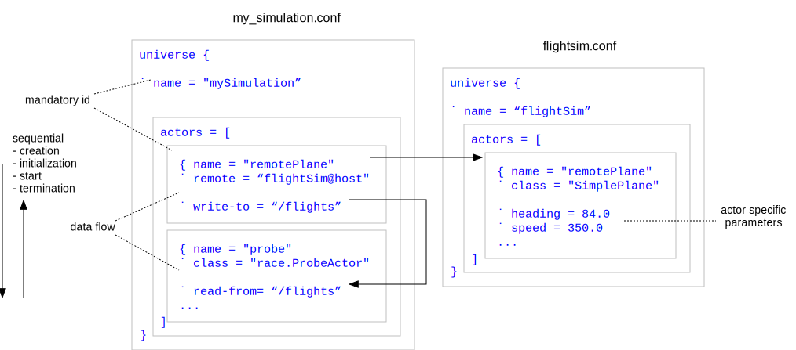
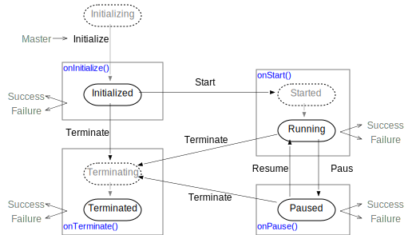
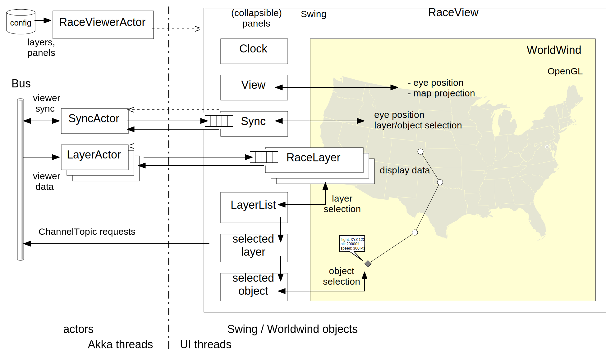

:Date: 2016-06-16
:Authors: - Peter Mehlitz <peter.c.mehlitz@nasa.gov>
          - Nastaran Shafiei <nastaran.shafiei@nasa.gov>
          - Oksana Tkachuk <oksana.tkachuk@nasa.gov>
          - Misty Davies <misty.d.davies@nasa.gov>

          
                         ==================================================================
                         RACE - building airspace simulations faster and better with actors
                         ==================================================================


Abstract
--------
Creating large, distributed, human-in-the-loop airspace simulations does not have to take armies of developers and years
of work. Related code bases can be kept manageable even if they include sophisticated interactive visualization.
Starting such projects does not have to require huge upfront licensing fees. We showed this by using contemporary
internet software technology.

Our *Runtime for Airspace Concept Evaluation* (RACE) framework utilizes the *actor* programming model and open source
components such as *Akka* and *WorldWind* to facilitate rapid development and deployment of distributed simulations that
run on top of Java virtual machines, integrate well with external systems, and communicate across the internet. RACE
itself is open sourced and available from https://github.com/NASARace/race.


Introduction
------------

Use Case
````````
Imagine having to build a simulation that imports live data feeds such as real-time ADS-B aircraft positions, transmits
these live contacts to an existing, interactive flight simulator, receives back the simulated aircraft positions, and
displays all flights on several distributed geospatial viewers that can be synchronized in terms of eye position and
selected information.

Imagine further that once you have built such a simulation, requirements are extended to include import of live flight,
weather and airport data for the whole *National Airspace System* (NAS)  through FAA's *System Wide Information
Management* (SWIM [swim]_) servers, which can easily exceed 4000 live flights at any given time. Moreover, all this data
has to be recordable in order to replay it off-line for further analysis, or overlay it to live simulations at a later
time.

This is not a hypothetical use case - it was one of the motivating examples for the development of RACE, and it took
less than 15,000 lines of platform-independent code to implement. The remainder of this paper describes how this was
achieved, and how the resulting system can be further extended.


Targeted Application Properties
```````````````````````````````
Dissecting the above use case, several aspects of the targeted application domain stand out:

(1) The resulting applications are *event based*, they are reacting to external stimuli of different sources, formats
and communication channels.

(2) Applications can be *Live, Virtual or Constructive* (LVC) simulations. The system has to accommodate humans in the
loop by means of interactive components and external connectivity. For constructive simulations, applications should
support time scaling.

(3) Applications typically incorporate existing, external systems such as live data feeds and specialized simulators.
External systems are supposed to be used as-is. Adaptation has to happen within the application components, not the
external system.

(4) There is no fixed set of application components, hence the application framework has to support efficient
development of new components without having to change the existing code base. This especially calls for a component
model that is sufficiently understood and documented.

(5) Applications should be configurable in terms of component types and component interactions (communication).
Application components should be generic to support configuration.

(6) Applications can be massively concurrent, hence the framework they are built with has to free component developers
from the burden to do explicit synchronization and scheduling, which are notoriously difficult tasks.

(7) Applications can be distributed, for reasons of scalability and access to local resources such as hardware
simulators. Consequently, the component model should provide location transparency, i.e. should allow the user to
configure where a component runs without having to change its implementation.

(8) Most applications require specific visualization, hence the application framework has to provide an extensible
geospatial viewer infrastructure. Extensions can be related to new data channels, rendering methods, and user
interactions.

(9) RACE applications are (mostly) simulations; its components and the system as a whole have to be deterministic.
Similar input should produce similar results.

(10) Last but not least, everybody should be able to build RACE applications, hence the underlying framework should be
open sourced, and its core should only depend on open sourced third party libraries.


Background - Actors
-------------------

Most of the aforementioned properties depend critically on choosing a suitable *programming model* for  application
components, which is the basis and starting point for our discussion of RACE.

*Actors* are a model of concurrent computation that fits well into the outlined application domain. The basic idea is
*that resulting systems are homogeneously composed of a potentially large number of concurrently executing objects which
*only communicate through asynchronous messages and don't share state---the actors.

The concept of actors dates back to 1973  [hewitt73]_ and has been a research focus ever since. Actors became subject to
numerous scientific publications, including work on formal semantics [clinger81]_ [agha04]_, and as a consequence are
now among the best understood computational models for concurrency.

Actors do not exist in a vacuum, they do need an underlying runtime. Arguably the most prominent implementations so far
have been in *Erlang* [erlang]_, which integrates actors right into the language, and in *Akka* [akka]_--a framework
that is implemented in *Scala* [scala]_ and runs on Java Virtual Machines (JVMs). Both have seen extensive use in large
scale production systems, ranging from phone switches to web applications to cluster computing.

We chose Akka as the actor basis for RACE since we wanted to utilize the vast third party infrastructure that is
available for JVMs. As shown in Fig. 1, Akka actors have three essential features:

    * a system provided *actor reference* (handle) that is used to send messages to this actor,
    * a system managed *mailbox* that hold messages received by this actor,
    * a user provided *message handler*.

.. image:: ../images/actor.svg
    :class: left scale60
    :alt: actor features

Within each actor, processing of messages takes place sequentially in the order in which messages were received. The
Akka framework guarantees that no actor executes simultaneously in different threads. Actor references can only be used
to send messages, not to access internals of the respective actor. Together, these properties avoid data races---a
common root cause of concurrency related defects---which essentially allows the actor implementation to be viewed as a
sequential program.

This is an idealized model that only holds under the caveat that no shared mutable object is passed into an actor
constructor or is accessible through messages, which is why Scala as a (functional) programming language with emphasis
on immutable data is our language of choice for RACE implementation.

Akka actors require remarkably little overhead, a basic definition can be as simple as

    import akka.actor.Actor

    class MyActor extends Actor {
      def receive = {
        case msg => sender ! "got it"
      }
    }


Akka actors can communicate in two different ways:

    * point-to-point---a message is explicitly sent to the receiving actor,
    * publish-subscribe---the receiving actor registers its interest about a certain topic on an Akka *EventBus*, 
      and the senderpublishes messages to this bus without having to know about its subscribers.

Akka supports both communication types. For point-to-point communication, this includes full location transparency, i.e.
messages can be sent to actors running in different processes. For publish-subscribe, there needs to be additional
infrastructure to achieve seamless *remoting*, which is provided by RACE on top of Akka and is the subject of the next
section.


RACE Design
-----------

Since RACE applications are composed of actors, RACE leans heavily on Akka as its implementation basis. However, Akka
actors are intentionally application agnostic whereas RACE has a number of additional requirements and hence--among
other features---adds support for

    * fully runtime configurable systems,
    * deterministic system initialization and termination,
    * network enabled publish-subscribe mechanism with on-demand data flow control,
    * geospatial visualization by means of the *NASA WorldWind* [worldwind]_ viewer.

The remainder of this section will give a high-level overview of the RACE design and then look at each of these topics
separately.


Anatomy of a RACE System
````````````````````````
As depicted in Fig. 2, the starting point to understanding the RACE anatomy is a configuration file that specifies which
actors participate in a RACE application, and how these actors connect to each other. Configurations are text files that
are created outside of RACE.

.. image:: ../images/race-overview-2.svg
    :class: center scale60
    :alt: RACE overview

The top-level runtime component is the **RACE Driver**, which is usually the main class of a respective application and
directly invoked by the user. There are several driver variants depending on user interface and locality, but all share
the same set of basic functions:

    * select/acquire the contents of a configuration file and translate it into a configuration object,
    * instantiate a *RaceActorSystem* with this configuration object,
    * start, query and terminate this RaceActorSystem based on user commands.

The **RaceActorSystem** aggregates the following objects: the *Master* actor, the *Bus*, a *Clock*, and any number of
configured *RaceActors*.

Upon instantiation by the driver, the RaceActorSystem creates the Master, the Bus and the Clock, and then passes the
configuration object on to the Master actor.

The **Master** actor is responsible for creating and then supervising the configured RaceActors, providing the
sub-configuration for each particular actor as the sole constructor argument. There are four distinct phases of control
executed by the Master:

    * creation of configured RaceActors,
    * dynamic initialization of created RaceActors,
    * start of initialized RaceActors,
    * termination of started RaceActors.

Each phase is only entered after the preceding one has been completed. Within each phase RaceActors are processed
sequentially based on their configuration order, i.e. each actor can rely on all preceding actors having successfully
completed the respective phase.

The **Bus** is merely a wrapper around an Akka *EventBus* that implements a network enabled publish-subscribe mechanism
as the primary means of RaceActor communication.

The **RaceActors** finally are the application specific components, performing tasks such as importing from external
data sources, translation and filtering of imported data, visualization, analysis and more. Most RaceActors do so by
subscribing and publishing to Bus channels they obtain from their configuration data.

RaceActors are also the means to communicate with other RACE processes. By specifying the location (URL) of a RaceActor
in the RACE configuration, such remote actors can be seamlessly integrated into a RACE application, using normal Bus
channels for communication without the need of any remoting-specific user code. Remote actors can be looked up (in case
they have to be started locally) or instantiated remotely.

Based on this connectivity, it is possible to build whole topologies of interacting RACE systems.


Configuration
`````````````
RACE applications are not hard coded, they are configured by means of text files that specify which RaceActors partake
in a simulation, and what parameter values these actors should be initialized with. The preferred format for
configuration files is *HOCON* [hocon]_, which is a *JSON* [json]_ dialect that is focused on readability.

The underlying data model is a tree of key-value elements. Each element value can be either a primitive (String,
Boolean, Int etc.), an object (set of key-value pairs ``\{..\}") or an array of element values (``[..]"). Figure 3 shows
basic structure, elements and connections of RACE configuration files.





The top level element of a RACE configuration file is a `universe` object, which contains two main sub-elements: 

    * a `name` that identifies this RACE instance so that it can be referenced by other RACE processes,
    * an `actors` array that specifies which RaceActors are part of this RACE instance.

Each `actors` element specifies a single RaceActor, identified by a mandatory `name` element. Actors that are created by
this RACE process also need to have a `class` element holding the respective class name. An optional `remote` element
indicates this is a remote actor running on an external RACE system. Actors can also be marked as optional, in which
case a failed lookup or creation does not terminate the RACE initialization.

RaceActors that communicate through Bus channels have  `read-from` and `write-to` configuration elements, which hold
either single channel names or an array thereof. Channel names are strings that should use a path-like convention.
Channels do not need to be defined separately.

In addition to such system elements, each RaceActor can have any number of actor type-specific parameters. Values
starting with a "??" prefix are used as keys to look up sensitive configuration data (e.g. user credentials) in an
optional *vault*, which is a secondary configuration file that is encrypted. Vaults have to be specified during RACE
startup, require symmetric keys, and are never stored as clear text during execution.

Conceptually, RACE configurations use a declarative language to define a directed graph in which RaceActors represent
the nodes, and Bus channels represent the edges. The resulting graphs do not need to be acyclic.

RACE configurations contain more information than just type and connection of actors---the order in which actors are
specified does matter. The Master actor creates, initializes and starts RaceActors strictly according to this order, and
terminates them in reverse order. In each phase, an actor can depend on previous actors having completed the respective
phase.


RaceActors
``````````
RaceActors are Akka actors which are initialized from RACE configuration data, and implement a RACE-specific state
model. This state model closely follows the different lifetime phases of a RACE system:

    * creation,
    * initialization,
    * run (including suspend/resume),
    * termination.

The distinction between the creation and initialization phases becomes obvious when looking at RACE instances that
communicate through remote actors. While a remote actor might get instantiated by the remote RACE system ahead of time,
it still needs to be initialized with data (e.g. Bus channels) that integrate this actor into the local RACE system.

Since *location transparency* is an explicit design goal for RaceActors, we do not introduce a different state model for
remote actors, but call out dynamic initialization as a separate step. This has the added benefit that those local
actors needing initialization from other actors can make use of the same state model; this avoids actor-pair specific
protocols.

Figure 4 shows the basic RaceActor states and transitions.




Each of the RaceActor state transitions is initiated by the Master and mapped into a function that can be overridden by
the concrete actor class, which mixes in one or more of the system-provided `RaceActor` traits. The reference transition
sequence is as follows:

{} => *Initializing* : the initial transition is triggered when the Master instantiates a RaceActor, and
is implemented by means of its constructor chain. This usually includes static (context-free) initialization based on
the local actor configuration object which is the sole constructor argument.

*Initializing* => *Initialized* : this transition is triggered when the Master sends the *InitializeRaceActor*
system message that is mapped by the system into a `onInitializeRaceActor()` call. The purpose of this method is to
perform context-aware initialization based on a (possibly remote) configuration object that is part of the message. This
especially includes subscription to configured `read-from` Bus channels. After `onInitializeRaceActor()` returns, the
system activates the actor-specific `handleMessage()` method as the default message handler.

*Initialized* => *Running* : this marks the beginning of the simulation in response to a *StartRaceActor* system
message sent by the Master, which is mapped into an `onStartRaceActor()` call. Typical reactions include the start of
data publishing.

*Running* =>  *Terminated* : the final transition is triggered by receiving a *TerminateRaceActor* system message
from the Master, which results in an `onTerminateRaceActor()` call during which data production is stopped and external
connections are closed.

If RaceActors override a on\textit{\textless Message\textgreater}() method, they should call the respective `super`
method from within their implementation to make sure mixed-in system traits function properly.

Although system message callbacks are an important part of a RaceActor implementation, the primary feature is usually
the `handleMessage` dispatcher which is activated when the actor reaches the *Initialized* state. This dispatcher is a
Scala *Partial Function* that pattern matches on the message types and values which are processed by this actor. The
reason why this handler is not activated during actor construction is that message processing might depend on fields
which are not set before the *Initialized* transition is completed.

The following code snippet shows how system message callbacks and the message handler work together in the context of a
simple RaceActor example:

    import gov.nasa.race.core.PublishingRaceActor
    ...
    class Airplane (val config: Config)
            extends PublishingRaceActor with ... {
      val id = config.getString("id")
      var updateInterval = config.getDuration(...)
      var fpos: FlightPosition = ...
      ...
      override def onInitializeRaceActor(...,
                                    conf: Config) = {
        super.onInitialzeRaceActor(..,conf)
        fpos = getInitialPosition(conf)
      }

      override def onStartRaceActor = {
        startUpdateNotifications(updateInterval)
      }

      override def handleMessage = {
        case Update =>
          fpos = computeNewPosition(simTime)
          publish(fpos)
      }

      override def onTerminateRaceActor = {
        stopUpdateNotifications()
      }
      ...
    }

The standard RACE distribution contains a number of ready-to-use RaceActors for generic tasks such as Java Messaging
Service (JMS) import, XML-to-object translation, content-based filtering and more. While this collection of generic
system actors is supposed to grow, development of new, application-specific RaceActors is considered to be the primary
way to extend RACE and hence explicitly encouraged.


Bus Channels
````````````
Bus channels are the primary mechanism through which RaceActors communicate. They implement fully runtime configurable
publish-subscribe (1:N) messaging that works seamlessly with remote actors. Each channel is identified by a path-like
name (e.g. "/flights/positions"), which organizes the channels of a RACE system into a hierarchical name space that
allows selection of whole sub-trees by means of name patterns (e.g. "/flights/*").  If a channel name starts with a
"/local/" prefix, respective data will not be sent out to remote actors.

Within a RACE process, Bus channels carry very little runtime costs compared to external messaging systems. Channels do
not need to be separately defined, accept arbitrary object references as messages, involve minimal copying, and do not
require marshaling/un-marshaling. Within a process, channel messaging approaches the efficiency of function calls with
associated context switches.

Bus channels that are used between RACE instances do incur marshaling/un-marshaling costs. While this is transparent to
actor code, it shows the same 2-3 orders of magnitude throughput reduction that is typical for external message systems
and hence has to be taken into account when partitioning RACE systems.

The RACE Bus is a very thin wrapper around the normal Akka EventBus, which already supports sending messages to remote
actors, but does not provide the capability for remote actors to publish. This function is added by RACE, using
*BusConnector* actors that are automatically created by the Master and passed on to remote RaceActors during the
initialization phase. When the remote actor publishes a message, under the hood it sends this message point-to-point to
the associated BusConnector, which then publishes it to the local Bus.

Channel subscription and publishing is mostly implemented in two system traits that can be mixed into concrete RaceActor
classes:  *SubscribingRaceActor* and *PublishingRaceActor*.

During initialization of a SubscribingRaceActor, the system automatically subscribes the actor to all channels that were
specified in its `read-from` configuration element. Conversely, the system automatically unsubscribes the actor during
its termination.

The PublishingRaceActor provides a `publish(msg)` method that wraps the message payload into a *BusEvent* that records
channel, sender and payload, and then sends this BusEvent to the channels specified in the `write-to` configuration of
this actor.

Concrete SubscribingRaceActor classes then pattern match on the BusEvents they process within their `handleMessage`
methods:

    ...
    override def handleMessage = {
      case BusEvent(channel,x:X,sender) =>
        processXMsg(x)
      ...
    }


Channel Topics
``````````````
If Bus channels are the statically configured pipes through which RaceActors send and receive data, *ChannelTopics* can
be thought of as the valves that control the data flow along those pipes on-demand.

The rationale for implementing the ChannelTopic mechanism is that many external data sources are potentially high
volume, and do not allow fine grained control over which data they send. Such messages should only proliferate through a
RACE system if there are clients that actively process this data, and otherwise should be filtered as close to the RACE
system boundaries as possible.

Since a RaceActor should only have to know about the channels it subscribes to, and not about which actors publish to
those channels, the mechanism has to be fully transitive.

The two traits that implement the mechanism are *ChannelTopicSubscriber* (the requesting consumer) and
*ChannelTopicProvider* (the producer). Both define a protocol that works fully transitively and asynchronously, i.e.
providers can in turn request their own ChannelTopics when they receive a request, and respond once they got their
requests answered. A single ChannelTopic request can therefore trigger a whole set of (different but related) requests
upstream.

Request topics can either be application specific objects, or a system value indicating that a request pertains to the
whole channel. It is up to the ChannelTopicProvider to pattern match request topics it will serve.

Figure 5 depicts how a ChannelTopic request propagates through the system


.. image:: ../images/race-channeltopics.svg
    :class: center scale60
    :alt: channel topics


At each level, requests are handled in four steps:

    * the request itself by the ChannelTopicSubscriber actor,
    * a response by one or more ChannelTopicProvider actors,
    * an accept by the requesting actor to the selected provider,
    * data publishing of the accepted provider.

Providers that are also requesters can mix in the *TransitiveChannelTopicProvider* trait, which mainly is responsible
for mapping incoming to outgoing requests (a 1:N relationship).


WorldWind Viewer
````````````````
The most visible part of RACE is its *NASA WorldWind* [worldwind]_ interface. One of the primary use cases of RACE is to
visualize large, dynamic geospatial data sets, such as live flight positions within the whole national airspace (see
Fig. 7 screen shot).

Respective applications can vary significantly in terms of

    * input sources,
    * viewport and perspective,
    * supported interactions,
    * context-aware rendering of objects.
 
Such complex graphical user interfaces tend to require a large amount of platform-specific code that is expensive to
develop and maintain. In addition, most available user interface frameworks are not thread safe, and thus require
explicit, error-prone and hard-to-test synchronization between asynchronous data acquisition and user interface (event
dispatcher) threads.

RACE includes substantial infrastructure to mitigate these challenges. The centerpiece of this infrastructure is *NASA
WorldWind*   [worldwind]_--an open sourced OpenGL-based [opengl]_ geo viewer that runs on all major platforms and can be
embedded into Java applications.

Fig. 6 gives a conceptual overview of how WorldWind is integrated into RACE.



The primary WorldWind concept in the context of RACE is the *RenderableLayer*, which represents a display relevant data
set that can be separately controlled in terms of visibility, rendering and updates. RACE uses *RaceLayers* to map its
Bus channels into WorldWind layers. While a RaceLayer executes within the graphical user interface thread, it has an
associated *RaceLayerActor* which is responsible for data acquisition by means of RACE channel subscription. Since
RaceLayerActors execute within Akka threads, they use a dedicated queue within the associated RaceLayer to perform the
thread-safe handover of display data.

The second RACE-specific concept is the *UI Panel*, which represents a part of the user interface outside of, but
potentially interacting with, WorldWind. RACE comes with panels for various tasks such as controlling view positions,
selecting layers and displaying information about selected objects. UI panels are collapsible and stacked in a column to
the left of the top-level window, whereas WorldWind occupies the large canvas to the right of the panel column.

WorldWind is incorporated into RACE applications by means of a *RaceViewerActor*, which is just a normal RaceActor
within a RACE configuration. However, RaceViewerActors themselves can be extensively configured with both RaceLayers and
(less often) UI Panels:

    universe {
      ...
      actors = [
        ...
        { name = "geoViewer"
          class = "gov.nasa.race.ww.RaceViewerActor"
          ...
          layers = [
            { name = "livePos"
              class = "FlightPosLayer"
              read-from = "/live/fpos"
              description = "live flight positions" 
              ...
            },
          ...

Just as the RaceLayerActor/RaceLayer pairs, the RaceViewerActor has a dual in form of the *RaceView* user interface
object, which is both the aggregation and the mediator between the configured panels and the WorldWind window.

An important aspect of RACE's WorldWind infrastructure is the synchronization of different viewers. RACE Bus channels
can be used for more than just acquisition of display relevant data---they are also a convenient mechanism to exchange
viewer state between local and remote RaceViewers.

To that end, the viewer infrastructure includes a *SyncActor*/*SyncPanel* pair, which can publish viewer changes such as
eye position and layer selection to a global Bus channel, and conversely subscribe to this channel to update the local
display with remote viewer changes. This type of viewer synchronization is superior to generic, application-unaware
screen sharing because it:

    * supports fine grained, extensible control of synchronization aspects at the local node,
    * is robust in terms of re-synchronization (supports mute and tolerates lost connections),
    * lets users dynamically select the remote viewer(s) to synchronize with,
    * requires minimal data transfer between viewers (no high volume input events or large images have to be transmitted).

This infrastructure provides a powerful basis to use RACE for applications such as situation rooms: supporting the
integration of large screen displays with a variety of controller consoles and without having to resort to expensive and
limiting hardware-based solutions.


.. figure: race-nas-061416.jpg
   RaceView screen shot


Other Features
``````````````
There is more to RACE--several of its current features cannot be discussed in detail within the scope of this paper, and
are only briefly mentioned here.

The *RemoteLauncher* infrastructure allows the user to securely start, monitor and control RACE processes through SSH,
providing the capability to manage global resources such as configuration files, user ids and gateway access to external
servers from one central place. The RemoteLauncher especially targets multiple concurrent, automated simulations that
make use of dynamic resources such as cloud computing. For security reasons, the RemoteLauncher can be configured to run
remote RACE instances on login-less accounts. All communication with remote processes is tunneled through SSH, which not
only guarantees strong encryption but also simplifies related network configuration.

Many external data sources provide a superset of the required information in the form of pre-validated XML messages. For
trusted sources, full schema-based XML translation therefore often results in computational overhead that can be
avoided. To this end RACE comes with its own lightweight *XmlPullParser* support that can be more than an order of
magnitude faster than comparable solutions, allows convenient extraction of relevant information, and provides full path
context for XML elements.

The *XPlaneActor* that is distributed with RACE supports bi-directional communication with the commercial *X-Plane*
[xplane]_ flight simulator. The XPlaneActor uses a normal network socket to send flight positions to X-Plane for cockpit
view rendering, and in return receives the position of the simulator plane which can then be displayed with RACE's
WorldWind viewer.


Quantitative Profile
--------------------

The RACE distribution currently consists of about 200 source files with 12,500 lines of code (predominantly Scala), not
including some test tools to run third party servers. Roughly a third of this code is related to the viewer
infrastructure of RACE. The core itself is the smallest layer with about 1,350 lines of code.

The following runtime data was measured on a 15" MacBook Pro (2.8GHz Intel i7, 16 GB 1600MHz memory, AMD Radeon R9 M370X
with 2GB VRAM), running OS X 10.10.5 and Java 1.8.0\_91.

The analyzed RACE application included import of:

    * live SWIM Flight Data Publication Service (SFDPS) messages: ~4000 simultaneous flights, ~70 messages/sec,
    * live SWIM Airport Surface Detection Equipment, Model X (ASDE-X) messages: ~30 airports, ~30 messages/sec,
      50-150tracks per airport,
    * live SWIM Integrated Terminal Weather System (ITWS) precipitation image data:  ~80 images, 2-3 messages/sec,
    * live Automatic Dependent Surveillance-Broadcast (ADS-B) data, San Francisco Bay Area:  ~25 simultaneous flights,
      20-40 messages/sec.

All data was received as text messages over a wireless network and was translated into respective objects using load
balancing actors. Resulting flight objects and precipitation images were displayed by WorldWind LayerActors.

The viewer was configured to issue ChannelTopic requests when zooming in on an airport providing ASDE-X data, triggering
on-demand translation, publication and display of related ASDE-X track positions (aircraft and vehicles) at a 1Hz
interval.

The application used 25 actors with up to 13 simultaneously active channels.

The Java process loaded about 8900 classes and executed in up to 81 live threads, using between 200-500 MB of heap
memory.

The resulting CPU load averaged below 5% in stable viewer state, and peaked around 20% during garbage collection and
viewer interaction. The highest average CPU load of 10% over 10-15 sec occurred during sustained view changes such as
zoom and pan operations, identifying graphics as the most computationally intensive task of the system.

The screen shot in Fig. 7 gives a flavor of the involved volume of dynamic data (red dots represent live flights).

This demonstrates that RACE can process a realistic amount and rate of data on commodity hardware, without even having
to tap into its potential for massive multi-core architectures and cluster networks.


Limitations
-----------

While actors are a scalable and robust approach for designing massively concurrent and distributed systems, they are not
without their own challenges. During our work on RACE we identified a number of topics that should be subject to further
analysis.

The preferred /emph{modus operandi} for actors is to restrict themselves to communication through asynchronous messages
without sharing state, but sometimes shared memory within a RACE process is the best way to improve performance, reduce
redundancy and avoid complex synchronization protocols in absence of explicit locks. Except for the fact that it might
prevent location transparency, shared memory can be a viable design choice, provided that shared objects are immutable
during operation. Scala has a strong bias towards functional programming and hence features good support for immutable
data (e.g. with its collection library), but it is possible to create data races in Akka actor systems, especially
through actor constructor arguments and message fields. This could be mitigated by using targeted static analysis, but
so far tool support in this area is limited.

Seamless channel communication by means of remote actors is a powerful tool, but in absence of different APIs it is easy
to forget that (a) such communication comes at the potentially significant cost of marshaling/un-marshaling, and (b)
some objects might not support marshaling at all, resulting in runtime errors (e.g. for platform specific native
objects).

A specific problem of actor systems is detection and mitigation of mailbox saturation, commonly referred to as *back
pressure* management. Each actor mailbox is a queue of messages that are waiting to be processed, and if the actor
processing does not keep up with the rate at which messages arrive, it can create downstream problems. Since actor
mailboxes are Akka system objects (e.g. the required queue synchronization is hidden from user code), detection of back
pressure situations might have to resort to heartbeat messages that further increase message traffic and hence can
aggravate the situation they are supposed to remedy.

Back pressure management (e.g. with dispatcher/worker actor combinations as employed by RACE) is just one example of a
broader topic---while it is clear that there are actor patterns, those are not yet as well understood and documented as
common software design patterns. Existing literature such as the seminal work of Hohpe and Woolf[hohpe04]_ is mostly
focused on the integration aspect of messaging systems in the context of enterprise software.

Lastly, actors, Scala and Akka are not as mainstream as Java and explicit threading, and thus available workforce is
limited. However, the same can be said about most emerging technologies with a high innovation factor.


Conclusions and Future Directions
---------------------------------
In this paper we have presented the goals and design of RACE---an open sourced framework to build distributed, live,
virtual and constructive airspace simulations by means of the *actor programming model*. Reflecting on our work, three
conclusions stand out:

    * actors do provide the basis for extensibility and scalability that we had envisioned,
    * functional programming (Scala) combines well with actors,
    * although RACE is still under development, its minimal core together with the maturity of its third party system 
      basis (Akka, WorldWind) already allow applications that go beyond the scope of simple simulations.

From a technical perspective, our immediate plans are to extend the actor collection distributed with RACE, to add more
actor telemetry, and to use RACE in the context of runtime monitoring of future air traffic management models. In terms
of adoption and third party contribution, we intend to build an open source community around RACE.

This work is all the more satisfying as we see a lot of potential for future research, ranging from actor pattern
analysis to model checking to compositional verification of actor systems. RACE could be exciting for years to come.


.. [swim]: System Wide Information Management,
           http://www.faa.gov/nextgen/programs/swim/.

.. [hewitt73]: Carl Hewitt; Peter Bishop; Richard Steiger,
               "A Universal Modular Actor Formalism for Artificial Intelligence", IJCAI,1973.

.. [clinger81]: William Clinger,
   "Foundations of Actor Semantics",
   Mathematics Doctoral Dissertation. MIT, 1981.
   
.. [agha04]: Gul Agha; Prasanna Thati
   "An Algebraic Theory of Actors and Its Application to a Simple Object-Based Language - from OO to FM",
   (Dahl Festschrift) LNCS 2635. 2004.
   
.. [hohpe04]: Gregor Hohpe; Bobby Woolf,
   "Enterprise Integration Patterns - designing, building and deploying messaging solutions",
   Addison-Wesley, 2004.

.. [erlang]: Erlang Programming Language,
   https://www.erlang.org.
  
.. [akka]: Akka,
   http://doc.akka.io/docs/akka/current/scala.html.

.. [scala]: Scala Programming Language,
   http://www.scala-lang.org/.

.. [json]: JSON - JavaScript Object Notation,
   http://www.json.org/.

.. [hocon]: HOCON - Human Optimized Config Object Notation,
   https://github.com/typesafehub/config/blob/master/HOCON.md.

.. [worldwind]: NASA WorldWind - extensible geo viewer,
   http://worldwind.arc.nasa.gov/java/].

.. [opengl]: OpenGL,
   https://www.opengl.org/.

.. [xplane]: X-Plane - Ultra Realistic Flight Simulation,
   http://www.x-plane.com.


