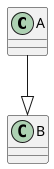

# Chapter 1

## Motivation

and here is some inline mermaid diagram:

```mermaid
graph TD;
    A-->B;
    A-->C;
    B-->D;
    C-->D;
```

or plantuml:

```plantuml,format=svg
@startuml
A --|> B
@enduml
```

