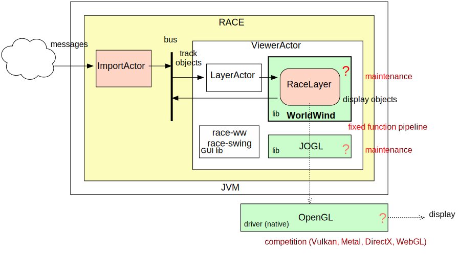

# Cesium/Browser based Visualization

## Slides
@:navigationTree { entries = [ { target = "#" } ] }

## In-Process: race-ww
* &check; no serialization/deserialization
* &check; dense GUI support (race-ww, race-swing)
* &#9888;︎ foundation has eroded (WorldWind, JOGL, OpenGL) → WorldWind needs major rewrite to make use of contemporary GPUs/drivers

1: ./race -Darchive=../data/all-080717-1744 config/air/swim-all-sbs-replay-ww.conf

## WorldWind Viewer Infrastructure
* RACE provides

    - async thread-safe data import for *Layers*
    - extensible UI framework of (Swing) *Panels*

## Browser: race-net-http
* &check; no end-user install, more devices (RACE used as web server)
* &check; 3rd party libs future proof (akka-http, Cesium), good HW support, full 3D (meshes)
* &#9888; requires network IO plus serialization/deserialization per app object update
* &#9888; less interaction (server scalability), UI density

1: ./race --vault ../conf -Darchive=../data/all-080717-1744/sbs.txt.gz config/net/cesium-track-server.conf

## RACE HttpServer Infrastructure
* department (low/medium traffic) server
* specifically for dynamic content (track updates)

## Cesium
* [Cesium] is a geospatial viewer (virtual globe) with open sourced [CesiumJS] Javascript API
* runs in any browser that supports [WebGL] standard
* examples on [Sandcastle]

[Cesium]: https://cesium.com/
[CesiumJS]: https://cesium.com/learn/cesiumjs/ref-doc
[Sandcastle]: https://sandcastle.cesium.com/
[WebGL]: https://www.khronos.org/webgl/