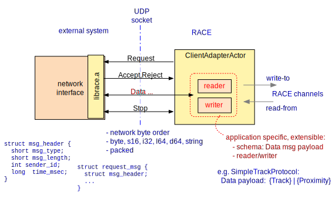
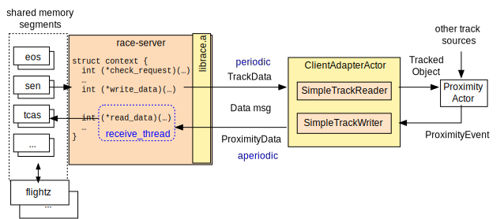

# Connecting RACE

## Import/ExportActors
* dedicated import/export actors
* separation of protocol (actor: JMS,Kafka,..) and optional payload data handling (readers/writers)

## RaceAdapter
* native lib + generic actor to connect external systems without network interface
* lightweight protocol with extensible/configurable payload data

## Flightdeckz Example
* uses `SimpleTrackProtocol` (bi-directional track and proximity data)
* `race-server` process using `librace.a` to read/write shared memory segments

