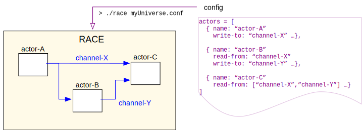

# RACE
building airspace simulations faster and better with actors

<https://github.com/nasarace/race>

~

<a href="https://ti.arc.nasa.gov/profile/pcmehlitz/" rel="author">Peter.C.Mehlitz</a> 
SGT Inc, NASA Ames Research Center

## Slides
@:navigationTree { entries = [ { target = "#" } ] }

## Targeted Application Domain
* event driven (originally LVC simulations)
* extensible event processors (generic + domain specific)
* events can be own or external
* interfaces to existing systems (live + simulators)
* can be used as stand-in for live systems
* distributed (collaborative, local access to external systems)

## Main Design Drivers
**uniform programming model** for components supporting:

* scalability ("single aircraft to whole NAS")
* massively concurrent and distributed operation
* wide range of component types ("3-liners to whole subsystems")
* genericity (components can be configured and combined)
* platform independence ("builds and runs everywhere")

## Foundation: Actor Programming Model
* well known concurrency programming model since 1973 (Hewitt et al)
* _Actors_ are objects that communicate only through async messages  
⟹ no shared state
* objects process messages one-at-a-time ⟹ sequential code

## Actor Implementation in RACE
* using open sourced **Akka** framework (<http://akka.io>)
* programmed in Scala (running on standard Java 8+ platform)
* extends `RaceActor` type hierarchy 
* uniform programming model for large *and* small components:

<pre>
   class ProbeActor (config: Config) extends SubscribingRaceActor {
     def handleMessage = {
       case BusEvent(channel,msg,sender) => println(msg)
     }
   }
</pre>

## RaceActors

* specialized Akka actors
* implement underlying state model in library classes
* support sequential, deterministic system-

    + construction
    + initialization
    + start
    + termination
    
* concrete RaceActors mostly just define (user-) message handler
* communicate through (configured) _channels_ (publish/subscribe)
* support _location transparency_ (can be distributed across network)

## Actors don't live in a vacuum - RaceActorSystems
1. `RemoteMain` driver instantiating `RaceActorSystem` with config
2. `RaceActorSystem` instantiating `Master` actor
3. `Master` actor instantiating configured `RaceActors`

## Everything is configured
 * RACE is **not** a monolythic application - needs configuration as input
 * configs are text files with formal syntax (*HOCON*)

           universe {
             name = "mysimulation"
             ...
             actors = [
               { name = "aircraft"
                 class = "gov.nasa.race.actors.SimpleAircraft"
                 write-to = "/flightpos"
                 heading = 42
                 ...
               },
               { name = "probe"
                 class = ...
                 read-from = "/flightpos"
               }
               ...

## Configuration is declarative DSL
configs define graphs:

* nodes are actors
* edges are channels through which actors communicate

## Example Schematics

## Example Screenshot
live demo

## Example Numbers
application domain:

* full SWIM import (sfdps,tfmdata,asde-x,itws)
* live ADS-B receiver import
* \> 4000 simultaneous flights
* \> 130 msg/sec (incl. large tfmdata, asde-x messages \> 100 items)

implementation:

* ~9000 classes (~14000 loc)
* \> 50 live threads
* 200-500 MB heap memory
* < 10% CPU load on MacBook Pro (2.8GHz Intel i7, 16GB)

## Lessons Learned
* actors are a suitable programming model for this domain
* rich research topic (**patterns**, monitoring, partitioning)
* pragmatic combination of functional and object oriented programming works,
  but experienced users tend towards FP
* actor separation can be broken (global data in constructors and messages)  
  ⟹ needs safeguards (design/FP, tools)
* location transparency offset by marshalling/unmarshalling costs  
  ⟹ keep data + processing local
* framework needs to measure and handle _back pressure_  
  ⟹ on-demand data, dynamic adaptation, load balancing

RACE scales!

## Extra Topics
* location transparency (distributed RACE)
* ChannelTopics (on-demand data)
* geospatial visualization (WorldWind)

## RaceActors/Systems support Location Transparency
* actors can be moved between processes
* no need to change actor code - just configuration

## Data on Demand - ChannelTopics
* RaceActors only know the channels they read from and write to
* *ChannelTopics* are "valves" to turn on/off data flow along channel "pipes"
* transitive, async protocol for provider-lookup & registration

## RaceViewer Visualization - WorldWind in an Actor
* adds thread-safe data acquisition (Layers) and UI framework (Panels)
* supports viewer synchronization through RACE channels

