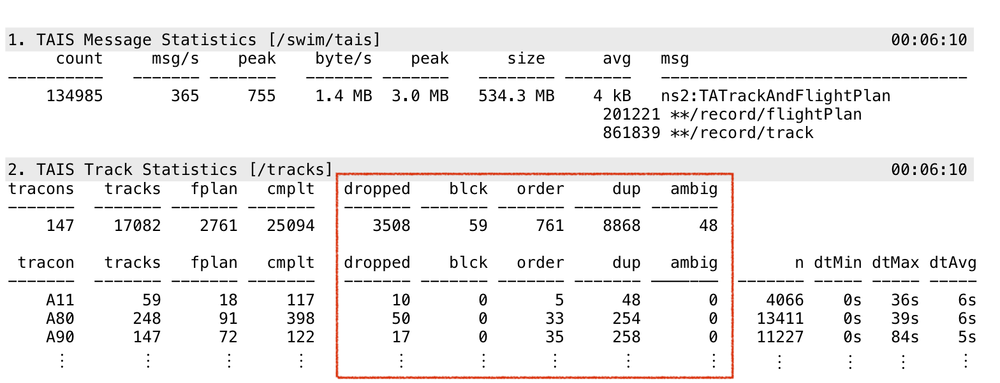
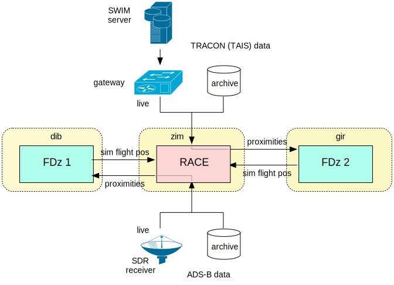

# Analyzing Airspace Data with RACE

website: <http://nasarace.github.io/race> 
repository: <https://github.com/nasarace/race> 

{Peter.C.Mehlitz, Dimitra.Giannakopoulou, Nastaran.Shafiei}@nasa.gov 
NASA Ames Research Center

## Slides
@:toc root="#currentDocument".

## What is RACE?
* started as a distributed LVC simulation framework in 2015

* evolved into a general event driven application framework:

    + can import/export from/to external systems - **connectivity**
    + can process high event rate and data volume - **scalability**
    + supports distributed and massively concurrent operation
    + has batteries included (except Java runtime, SBT build system)

## RACE Implementation
* runs on JVM, programmed in Scala using Akka actor library
* basic building blocks are **actors** - objects that only communicate through messages (processed
sequentially)
* RACE messages are sent through **channels**
* RACE actors/channels runtime configured (JSON), not hardwired

## Presented Example Applications
automatic detection of

* (1) temporal inconsistencies in SWIM messages
* (2) unsafe parallel approach trajectories
* (3) trajectory deviations between different reporting systems
* (4) loss of separation between live and simulated aircraft

##  Common Tasks of Example Applications

mapped to dedicated actors

* import async data messages from external systems
* translate relevant external messages into data model entities
* filtering entities for relevance
* analyze relevant entities
* (opt) export entities to external systems
* report/visualize results

## (1) Detecting Temporal Inconsistencies in SWIM Messages
* anomalies:

* RACE report:

## (1) Temporal Inconsistencies - Implementation & Lessons

* only ~140 app specific lines of code (mostly HTML formatting)
* original goal was only XML schema validation - time series analysis added
after visualization showed anomalies
* import layer convenient to switch between input sources
* first application to use HTML server for reporting (was running headless
in private network)

## (2) Detecting Unsafe Parallel Approach Trajectories
goal: automatically detect parallel approaches that are angled-in exceeding 
30° heading differences within given distance (causing loss of sight)

## (2) Parallel Approach - Implementation & Lessons

* ~180 lines of code (approach analyzer)
* quadratic problem: pairwise trajectory comparison of un-synchronized irregular time series
* ? GPU-based brute force approach did not work (data transfer costs)
* approach: filter candidates, detect parallel approach, interpolate and compare traces 
* more trajectory infrastructure needed (traces, extrapolation/interpolation)

## (3) Detecting Deviations between Tracking Systems
* how do positions for same flight differ between different input sources
(ASDE-X, TAIS, SFDPS, direct ADS-B)?
* are differences random or systematic?

## (3) Track Deviation - Implementation & Lessons

* ~180 lines of code (trajectory comparer)
* again motivated by visualization (noticing discrepancies)
* import layer convenient to switch between channels (SFDPS,TAIS,ASDE-X)
* again pairwise trajectory comparison but pair detection easy (flight id)
* comparison requires interpolation and statistics computation (variance)

## (4) Detecting Loss of Separation
* heterogeneous system: combines live (SWIM) data and external simulators
* RACE used as a data hub that adds analysis (proximities, LoS detection) 

## (4) Loss of Separation - Output
* left shows TCAS display of flight simulator (flight FDZ001) - live flight XY333 shown as alert
* right shows RACE viewer with LoS event between simulated (FDZ001) and live (XY333) flight

## (4) Loss of Separation - Implementation & Lessons
* uses generic native interface layer (memory layout, native library for external simulator)
* highly parallel problem (trajectory extrapolation, proximity calculation)
* was another GPU candidate but same problem (CPU-GPU data transfer requires optimizations
that significantly reduce extensibility)

## Conclusions
* actors are a good programming model for target applications
* implementation platform (JVM, Scala, Akka) was suitable basis but favor throughput over latency
(soft realtime)
* RACE's runtime config suitable for prototyping, less so for production systems
* discrete flight updates require domain specific support for interpolation, extrapolation
* visualization is important but currently a problem (general: native APIs, specific: WorldWind) 
* native code/memory support needs to be extended (hybrid systems interfacing, graphics APIs, 
utilizing SIMD for parallel computation ? GPU ?)

