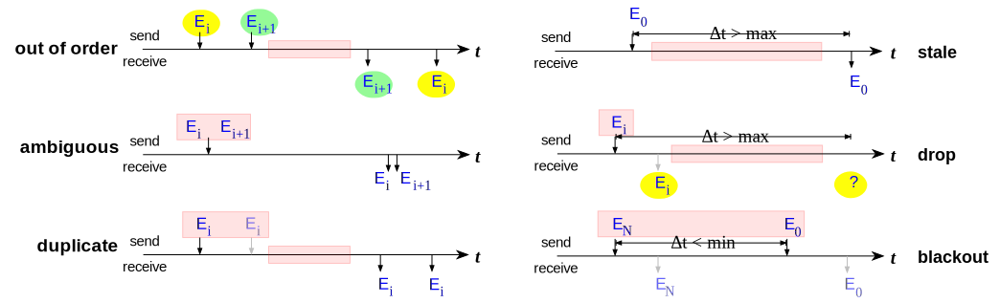
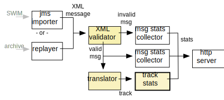
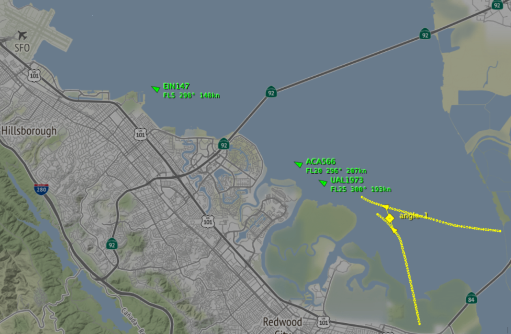
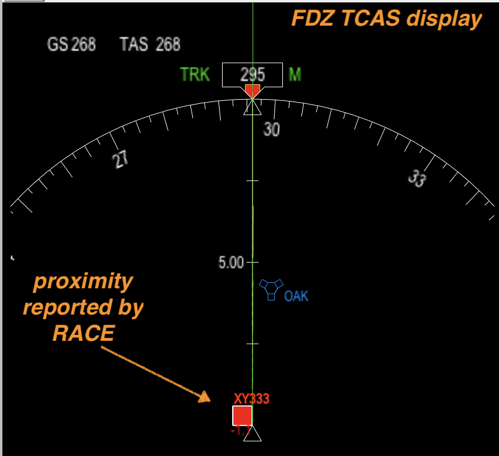
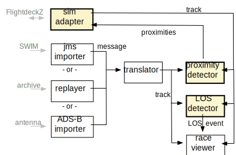

# Analyzing Airspace Data with RACE
showcase and evaluation 

website: <http://nasarace.github.io/race> 
repository: <https://github.com/nasarace/race> 

~

<a href="https://ti.arc.nasa.gov/profile/pcmehlitz/" rel="author">Peter.C.Mehlitz</a> 
<a href="https://ti.arc.nasa.gov/profile/dimitra/" rel="author">Dimitra Giannakopoulou</a> 
<a href="https://ti.arc.nasa.gov/profile/nshafiei/" rel="author">Nastaran Shafiei</a> 
SGT Inc, NASA Ames Research Center

## What is RACE?
framework to build event driven applications that

* can import/export from/to external systems - **connectivity**
* can process high event rate and data volume - **scalability**
* have extensible set of concurrent, low overhead components
* support distributed and massively concurrent operation
* developed since 2015

## Actors
* basic building blocks of RACE applications
* well known concurrency programming model since 1973 (Hewitt et al)
* _Actors_ are objects that communicate only through async messages  
⟹ no shared state
* objects process messages one-at-a-time ⟹ sequential code

## Configuring RACE Actor Systems
* RACE actor systems are JSON configured graphs
* nodes are actors
* edges are pub/sub (bus) channels through which actors communicate

## Target Application Model
common tasks of example applications (mapped to dedicated actors):

* import async data messages from external systems
* filtering messages for relevance
* translate relevant external messages into data model entities
* analyze entity state (changes)
* (opt) export entities to external systems
* report/visualize results

## (1) Detecting Temporal Inconsistencies in SWIM Messages
* anomalies:

* RACE report:

## (1) Temporal Inconsistencies - Implementation & Lessons
* original goal was only XML schema validation - time series analysis added
after visualization showed anomalies
* import layer convenient to switch between live/recorded and different channels
* first application to use HTML server for reporting (was running headless
in private network)
* only ~140 app specific lines of code (mostly HTML formatting) because 
of generic statistics and reporting support

## (2) Detecting Unsafe Parallel Approach Trajectories
goal: automatically detect parallel approaches that are angled-in exceeding 
30deg heading differences within given distance (causing loss of sight)

## (2) Parallel Approach - Implementation & Lessons
* quadratic problem: pairwise trajectory comparison of un-synchronized irregular time series
* approach: filter candidates, detect parallel approach, interpolate and compare traces 
* GPU-based brute force approach did not work (data transfer costs)
* more trajectory infrastructure needed (traces, extrapolation/interpolation)
* ~180 lines of code (approach analyzer)

## (3) Detecting Deviations between Tracking Systems
* how do positions for same flight differ between different input channels
and sensor systems (ASDE-X, TAIS, SFDPS, direct ADS-B)?
* are differences random or systematic?

## (3) Track Deviation - Implementation & Lessons
* again motivated by visualization (noticing discrepancies)
* import layer convenient to switch between channels (SFDPS,TAIS,ASDE-X)
* again pairwise trajectory comparison but pair detection easy (flight id)
* comparison requires interpolation and statistics computation (variance)
* ~180 lines of code in trajectory comparer

## (4) Detecting Loss of Separation
* heterogeneous system: combines live (SWIM) data and external simulators
* RACE used as a data hub that adds services (proximities, LoS detection) 

## (4) Loss of Separation - Output
* left shows TCAS display of flight simulator (flight FDZ001) - live flight XY333 shown as alert
* right shows RACE viewer with LoS event between simulated (FDZ001) and live (XY333) flight

## (4) Loss of Separation - Implementation & Lessons
* uses generic native interface layer (memory layout, native library for external simulator)
* highly parallel problem (trajectory extrapolation, proximity calculation)
* was another GPU candidate but same problem (CPU-GPU data transfer requires optimizations
that significantly reduce extensibility)

## Conclusions
* actors are a good programming model for target applications
* implementation platform (JVM, Scala, Akka) was suitable basis but favor throughput over latency
(soft realtime)
* RACE's runtime config suitable for prototyping, less so for production systems
* discrete flight updates require domain specific support for interpolation, extrapolation
* visualization is important but currently a problem (general: native APIs, specific: WorldWind) 
* native code/memory support needs to be extended (hybrid systems interfacing, graphics APIs, 
utilizing SIMD for parallel computation)

Thank You!
 
