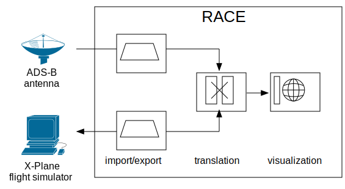
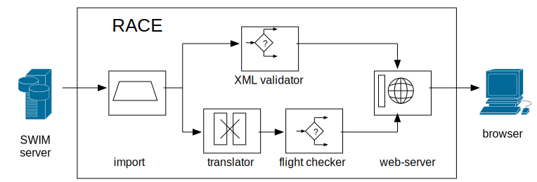

# RACE
the fast way to concurrent and distributed network applications

<https://github.com/nasarace/race>

## What is RACE
* RACE is a set of libraries to build event driven applications
* supports massively concurrent and distributed operation
* originally meant for creating large LVC airspace simulations

## How does RACE work
* centered around **actor programming model**
* actors communicate through logical channels on message bus
* actors and channels are configured (JSON/HOCON)
* deterministic system initialization/termination following state model
* strict supervisor hierarchy (master)

## RACE Implementation (5/15/17)
* implemented in Scala, runs on JVMs
* open sourced under Apache v2 license
* source repository on <https://github.com/nasarace/race>
* jars on Maven Central gov.nasa.race

* 14 production / 8 test modules
* 333 source files (320 scala, 13 java)
* 140 traits, 500 classes
* 22,000 non-comment lines of code
* 40 documentation pages (markdown and rst)

## RACE Use Case 1: VR simulation
* import ADS-B messages from antenna/SDR (35 flights with 1-2 Hz update)
* translate ADS-B messages into flight objects
* connect to X-Plane flight simulator, import flight simulator state
* compute proximity flight objects for simulator position
* send real proximities to flight simulator (cockpit view)
* display simulator and real flight objects in geospatial viewer (WorldWind)

## RACE Use Case 2: live NAS monitoring
* import enRoute flight info from SWIM (4500 flights with 12 sec update)
* validate XML messages, create statistics (total, rate, size etc.)
* translate enRoute messages into flight objects
* check for duplicated, out-of-order and ambiguous messages, create statistics
* export statistics through embedded web server

