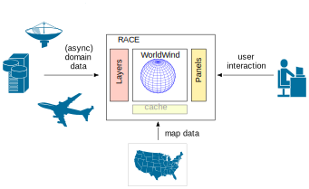

# RACE & WorldWind
**actors around the globe**

<https://github.com/nasarace/race>

~

<a href="https://ti.arc.nasa.gov/profile/pcmehlitz/" rel="author">Peter.C.Mehlitz</a> 
SGT Inc, NASA Ames Research Center

## Slides
@:navigationTree { entries = [ { target = "#" } ] }

## Outline
more *show*, less *tell*:

1. what you will see
2. demo
3. how it works

## WorldWind Application Challenges
don't re-invent the wheel:

* how to get & process data
* how to add data-specific UI

## RACE to the rescue
* embed WorldWind into RACE application
* RACE adds data acquisition and (WorldWind specific) UI framework

## Perfect Symbiosis

* RACE
    - good at importing, routing and processing dynamic data in distributed systems
    - needs multi-display geospatial visualization for (flight) data
    - runs on JVM
    - open sourced & .gov copyrighted

* WorldWind
    - good at rendering layered information on interactive map/globe via OpenGL
    - needs data acquisition interface, UI framework
    - runs on JVM
    - open sourced & .gov copyrighted

## WorldWind perspective: Layers and Panels

* RACE provides

    - async thread-safe data import for *Layers*
    - extensible UI framework of (Swing) *Panels*

## RACE perspective: Lego box of actors
* WorldWind as one of the building blocks
* don't look at the details (yet)

## Demos
* live data import (lots of!)
* synchronized remote viewer
* virtual reality

## Concrete Schematics

## Abstract Schematics
* RACE is **not** a monolythic application, its a generic framework
* uniform building blocks: **Actors**
* composition and interaction of actors is configured

## So what are these actors anyway?

* concurrency programming model since 1973 (Hewitt et el)
* objects that communicate only through async messages ⟹ no shared state
* process messages one-at-a-time ⟹ sequential code

## How are actors implemented in RACE?
* using **Akka** <http://akka.io>
* programmed in Scala (running on JVM)
* extended by `RaceActor` (configuration, state, initialization, remoting)
* uniform programming model for large (WWJ) *and* small components:

<pre>
   class ProbeActor (config: Config) extends SubscribingRaceActor {
     def handleMessage = {
       case BusEvent(channel,msg,sender) => println(msg)
     }
   }
</pre>

## Actors don't live in a vacuum - RaceActorSystems
* deterministic, synchronous initialization & termination
* central supervision & control (master)
* distributed - can seamlessly communicate with each other

## Congratulations - you have reached the bonus part
* RaceLayers and AkkaSwingBridge
* data-on-demand: ChannelTopics
* remote viewer synchronization
* UI framework - Panels

## RACE and WorldWind under the hood
thread-safe data-import and UI model:

## Data Integration on demand - ChannelTopics
don't overwhelm UI threads (0.1 sec rule) ⟹ ChannelTopic "producer valves"

## Synchronized Viewers

## UI Framework
