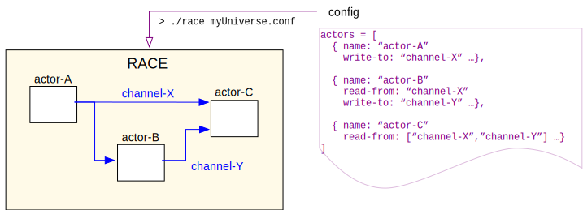

# RACE
scaling the world with actors 
in 10 minutes

<https://github.com/nasarace/race>

~

<a href="https://ti.arc.nasa.gov/profile/pcmehlitz/" rel="author">Peter.C.Mehlitz</a> 
SGT Inc, NASA Ames Research Center

## Slides
@:toc root="#currentDocument".

## What is RACE?
framework to build event driven applications that

* can import/export from/to external systems - **connectivity**
* can process high event rate and data volume - **scalability**
* have extensible set of concurrent, low overhead components
* support distributed and massively concurrent operation

example: 

## Example - Live NAS
* full NextGen SWIM (System Wide Information Management) import (500+ msg/sec)
* real time ADS-B import from local antenna
* visualization with NASA WorldWind

 
## Actors - Basic RACE Components
* well known concurrency programming model since 1973 (Hewitt et al)
* _Actors_ are objects that communicate only through async messages  
⟹ no shared state
* objects process messages one-at-a-time ⟹ sequential code

## Actor Systems - Configuration
* RACE actor systems are JSON configured graphs

    + nodes are actors
    + edges are pub/sub (bus) channels through which actors communicate

## RACE - Implementation
* _Master_ actor: initialization, supervision and termination of configured actors
* can model time
* local and global (network) bus

## Example - SWIM Analysis
* used inside FAA network to analyze SWIM channels (SFDPS, ASDE-X, TAIS, ..)
* statistics (msg rate, volume, peaks)
* XML validation
* checks for track update anomalies (duplicated, ambiguous, out-of-order, blackout, stale,..)
