# RACE by Example

website: <https://nasarace.github.io/race>  or <a href="../index.html">local</a> 
repository: <https://github.com/nasarace/race> 

Peter.C.Mehlitz@nasa.gov 
NASA Ames Research Center

(use &lt;pgDown&gt;, &lt;space&gt; or &lt;enter&gt; keys to scroll to next page)

## Slides
@:navigationTree { entries = [ { target = "#" } ] }

## Where did RACE come from?
* started as a distributed LVC simulation framework in 2015
  
  
* evolved into a general framework for event driven concurrent/distributed applications:

    + can import/export from/to external systems - **connectivity**
    + can process high event rate and data volume - **scalability**
    + supports distributed and massively concurrent operation
    + has batteries included (except Java runtime, SBT build system)

## Application Gamut
* common theme is parallel computation
* ranges from distributed/network applications to heterogeneous (GPU/SIMD) computation
* main focus is concurrent (multithreaded) program domain (without the pitfalls of thread sync)
* primary components are *Actors*

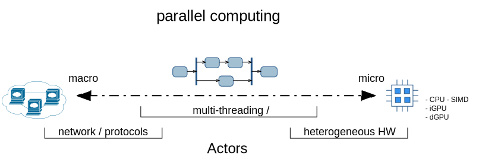

## RACE Foundation: Actor Programming Model
* well known concurrency programming model since 1973 (Hewitt et al)
* _Actors_ are objects that communicate only through async messages
  ⟹ no shared state
* objects process messages one-at-a-time ⟹ sequential code

## RACE Implementation: Actor System
* runs on JVM, programmed in Scala using Akka actor library
* RACE = set of communicating actors
* RACE messages are sent through (logical) publish/subscribe **channels**
* RACE actors/channels are runtime configured (JSON), not hardwired

## RACE Application Design
* uniform design - everything is an actor
* toplevel actors are deterministically created, initialized and terminated
  by _Master_ actor
* actors communicate through (configured) bus channels

## Example 1: Data Diversity and Volumne
* live NAS visualization plus local sensors
* imports SWIM messages (SFDPS,TFM-DATA,TAIS,ASDE-X,ITWS) and local ADS-B
* up to 1000 msg/sec, 4500 simultaneous flights
* RaceViewerActor uses embedded NASA WorldWind for geospatial display

  
  

1: ./race --vault ../conf config/air/swim-all-sbs-ww.conf

## Example 2: (re)Play it Again
* only import actors are replaced with replay actors
* everything else stays the same

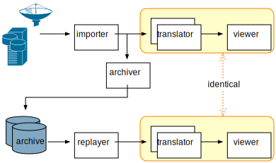

1: ./race -Darchive=../data/all-080717-1744 config/air/swim-all-sbs-replay-ww.conf

## Example 3: Now With Remote Actors - Location Transparency
* actors are *location transparent* - can be moved to different RACE processes
* can exchange data- (SWIM) and control- messages (viewer sync)

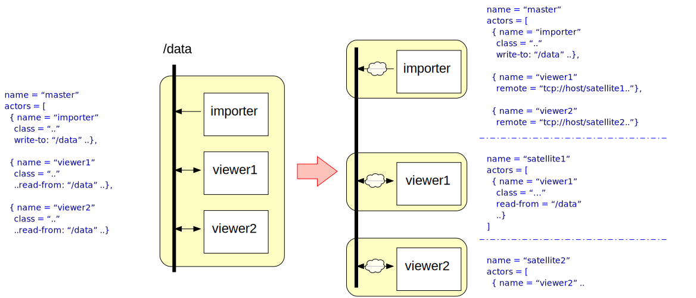

1: ./race config/remote-lookup/satellite1-replay.conf

2: ./race config/remote-lookup/satellite2-replay.conf

3: ./race  -Dmonitor.interval=15s -Darchive=../data/all-080717-1744/sfdps.ta.gz config/remote-lookup/master-replay-ww.conf

## Example 4: What Data - SWIM Message Statistics
* RACE more than a data visualizer
* example collects live SWIM message statistics
* serves results as a web page (embedded webserver actor)

  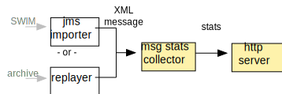
  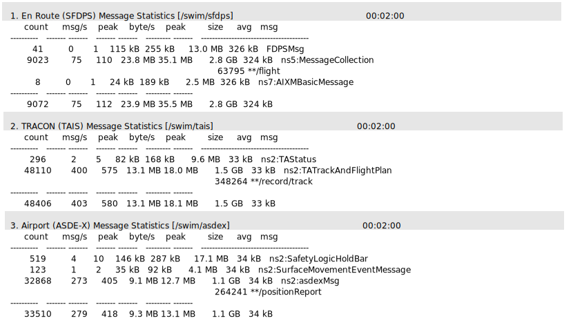

1: ./race --vault ../conf config/air/swim-msg-stats.conf

## Example 5: Is There a Problem with the Data?
* goal: find anomalies in flight update messages:

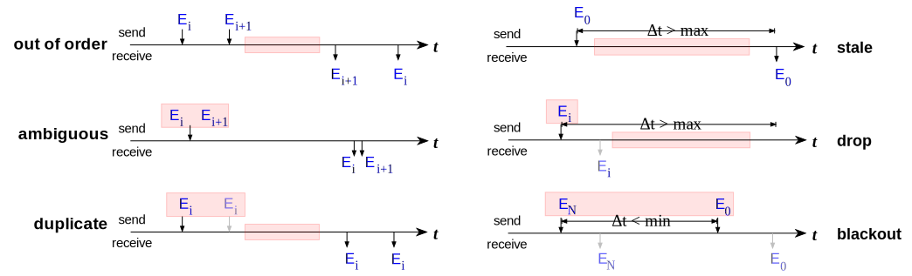

  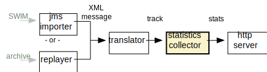
  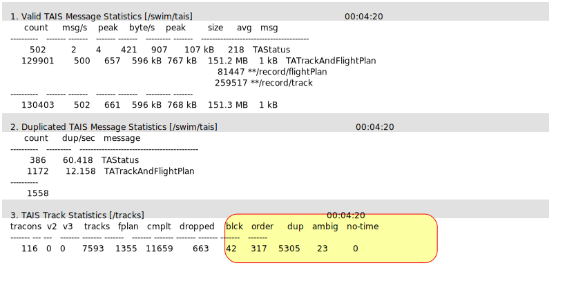

1: ./race -Darchive=../data/all-080717-1744/tais.ta.gz config/air/swim-tais-stats-replay.conf

## Example 6: Properties can be more Complex - Parallel Approaches
goal: automatically detect parallel approaches that are angled-in exceeding
30° heading differences within given distance (causing loss of sight)

  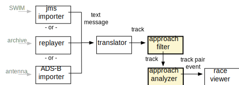
  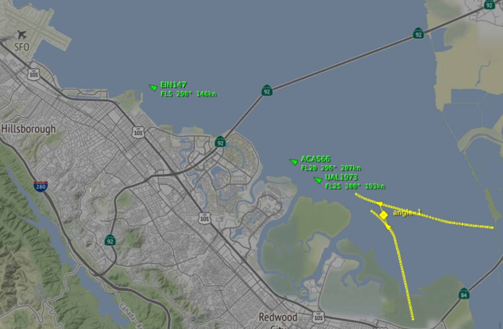

1: ./race -Darchive=../data/nct-121918-161829/tais.ta.gz -Dstart-time=2018-12-19T16:32:20.000-08:00 config/air/swim-tais-papr-replay.conf

## Example 7: More Complex Properties - Trajectory Deviation
* how do positions for same flight differ between different input sources
  (ASDE-X, TAIS, SFDPS, direct ADS-B)?
* are differences random or systematic?

  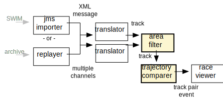
  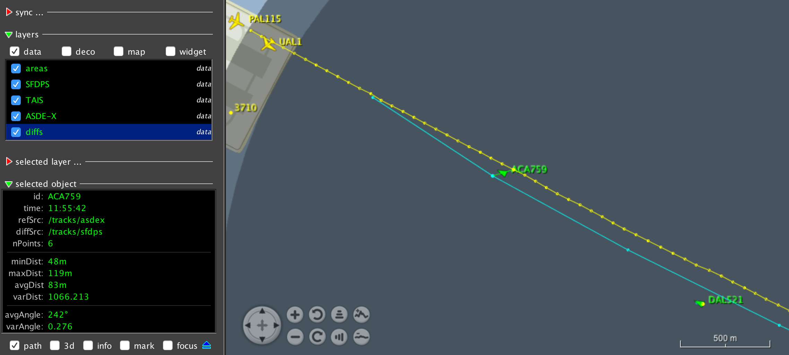

1: ./race -Darchive=../data/ACA759-070717-min -Dstart-time=2017-07-08T06:54:30Z config/air/swim-trackdiff-replay.conf

## RACE as a Hub - Connecting Simulators
* heterogeneous system: combines live (SWIM) data and external simulators
* RACE used as a data hub that adds analysis (proximities, LoS detection)

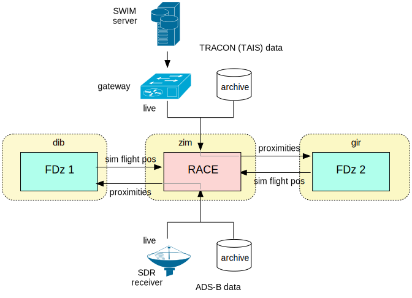

## Example 8: RACE as a Hub - Connecting Simulators
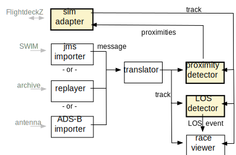

  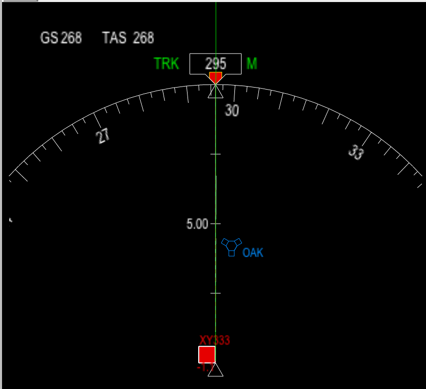
  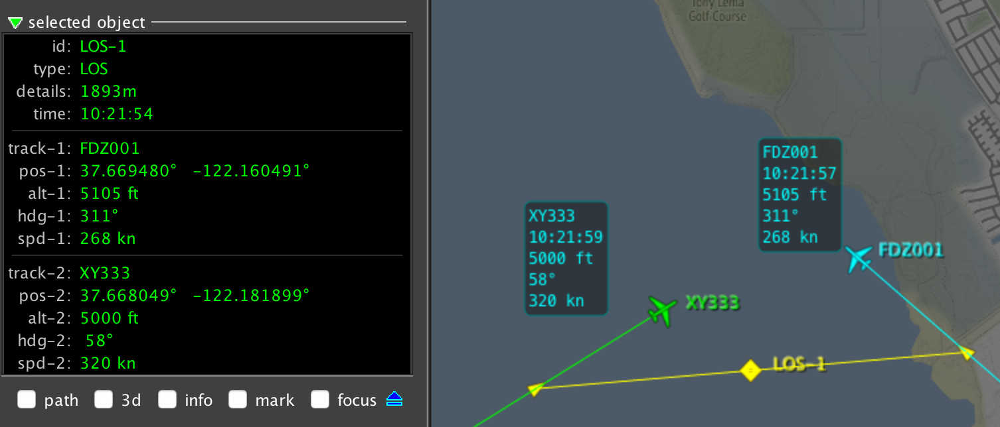

## Sharing Data Across Heterogeneous Organizations
* initial use case rapid rollout for disaster management
* applies to many situations where unified data view across organizational entities
  with intentionally isolated data is required

## Sharing Data - Overlay Network of RACE Nodes
* previous examples use a single RACE as data consumer/analyzer or hub
* can also be used to create networks of communicating RACE *nodes* (dedicated
  machines running RACE)

## Sharing Data - RACE Node Functions
* node interfaces through 4 actor types: user-server, node-server, node-client, provider-import/export
* org-local data display and entry through user-server (browser interface)
* sync with upstream and downstream nodes through node-server/node-client
* upstream/downstream/user clients: JSON over websockets (allowing non-RACE endpoints)

## Sharing Data - Application
* can be incorporated into any RACE application
* turns RACE applications into Web Application servers
* data model can include discrete event updates (counters) and streams (links)

  
  

## Example 9: Partitioning the Network (SHARE)
* network partitions continue to work locally when disconnected
* network re-synchronizes when partitions are re-connected

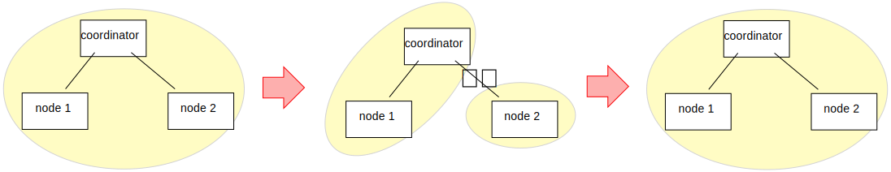

1: ./race config/share/share-coordinator.conf

2: ./race --vault ../conf config/share/share-node_1.conf

3: ./race config/share/share-node_2.conf

## TL;DR
* RACE is an actor based framework for building distributed and concurrent applications
* primary design goals: scalability and extensibility
* can be used as a library (from external projects)
* used for runtime monitoring, trajectory analysis, simulation, dynamic data web application server,
  distributed applications,...
* open sourced under Apache v2
* written in Scala, based on Akka library
* ~700 files, ~100,000 ncloc
* developed since 2015