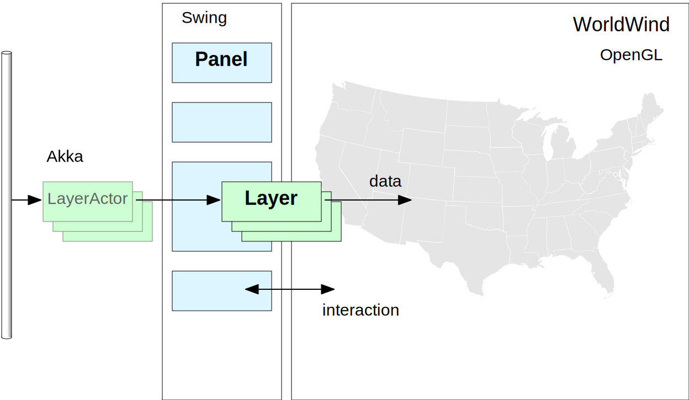
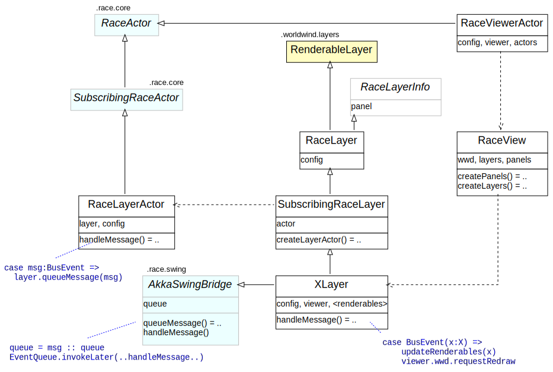
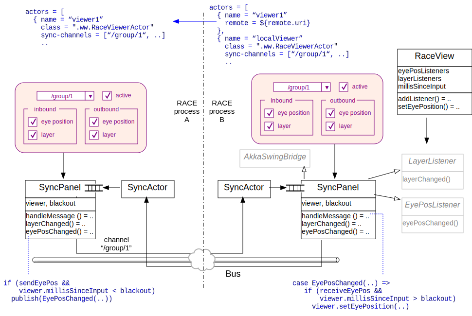
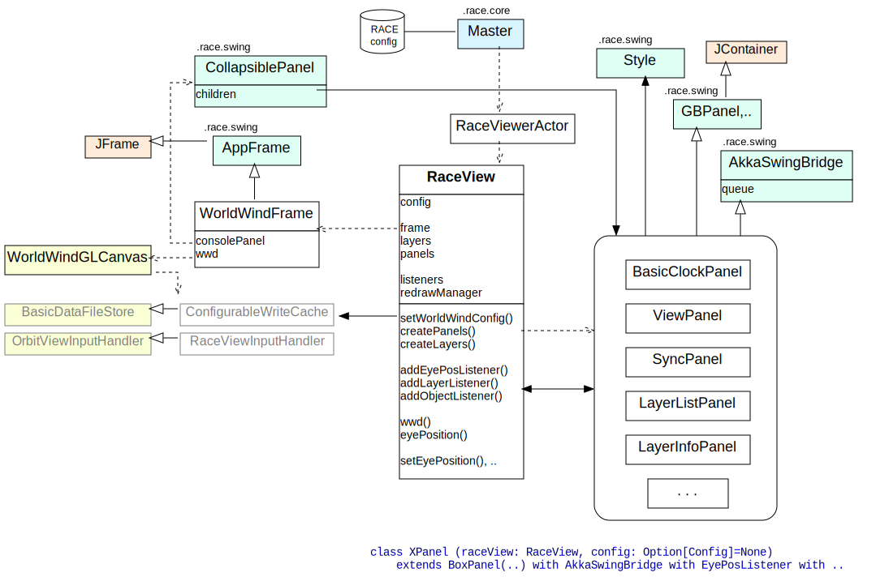

# RaceViewer Infrastructure
making it visible

## Slides
@:navigationTree { entries = [ { target = "#" } ] }

## Symbiosis - the best of two worlds

* RACE
    - good at importing, routing and processing dynamic data in distributed systems
    - needs (multi-display) geospatial visualization for flight data
    - runs on JVM
    - open sourced & .gov copyrighted

* WorldWind
    - good at rendering layered information on interactive map/globe via OpenGL
    - needs data acquisition interface, UI framework
    - runs on JVM
    - open sourced & .gov copyrighted

## RACE - WorldWind Integration

* RACE
    - async data interface for WW layers
    - viewer sync
    - configurable + extensible UI framework

* WorldWind
    - thread safety (thread safe use of `Renderable` objects)
    - animation target viewpoint observer (viewer sync)

## Big Picture: Configurable Extension Points

* data: RACE⟷WorldWind ⟹ Layers
* interaction: UI⟷WorldWind/RACE ⟹ Panels

## Big Picture: Zoom In on Bridges

## RACE Configuration
using normal RACE actor configuration:

    universe { ..
      actors = [
        { name = "simPlane" ..
          write-to = "/flights/sim" .. },

        { name = "viewer"
          class = ".ww.RaceViewerActor"
          layers = [
            { name = "flightPos"
              class = "gov.nasa.race.ww.layers.FlightPosLayer"
              read-from = "/flights/sim"
              description = "flight positions"
              categories = ["data" ..] .. } ..
          ]
          layer-categories = ["data" ..]
          panels = [ .. ]
          size = [1400,1000]
          eye { lat = 37.246822 .. }

## Data Integration

## Data Integration on demand - ChannelTopics
don't overwhelm UI threads (0.1 sec rule) ⟹ ChannelTopic "producer valves"

## Viewer Sync

## UI Framework

## Build Integration

* WorldWind does not (yet) publish build artifacts
* small modifications required by RACE
    - rendering thread safety (concurrent Renderable modification)
    - observable animation intentions (e.g. pan end-point)

* ultimately merge, interim solution: use SBT RootProject

<pre>
  ...
  lazy val wwjProject = RootProject( uri(
              sys.props.getOrElse("race.wwj_uri",
                  "git://github.com/pcmehlitz/WorldWindJava.git#pcm")))
  ...
  lazy val raceSwing = createProject("race-swing").
    dependsOn(raceCommon) ...

  lazy val raceWW = createProject("race-ww").
    dependsOn(wwjProject).
    dependsOn(raceCommon,raceData,raceCore,raceSwing) ...
</pre>
