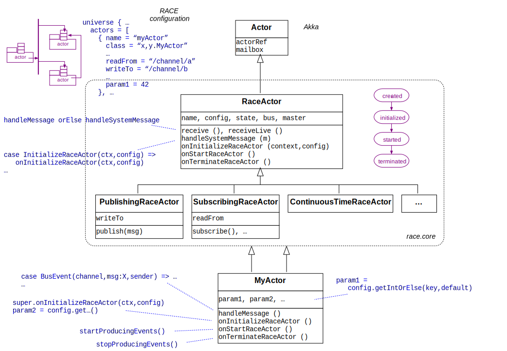

# RemoteLauncher
Run RACE Remotely

## Slides
@:navigationTree { entries = [ { target = "#" } ] }

## RemoteLauncher - one sentence purpose

Start, monitor and terminate remote RACE processes in a secure way from a central location

Dissection:

* what is a remote RACE process?
* what does it need to start one?
* what are the protected resources?

## (Excursion) What do we run - RemoteMain processes
1. `RemoteMain` driver instantiating `RaceActorSystem` with config
2. `RaceActorSystem` instantiating `Master` actor
3. `Master` actor instantiating configured `RaceActors`

## (Excursion²) Config is Everything
* configs are HOCON text files (`com.typesafe.config`)
* configs use a declarative language (graph with RaceActors as nodes and channels as edges)

        universe {
          name = "mysimulation"
          ...
          actors = [
            { name = "aircraft"
              class = "gov.nasa.race.actors.SimpleAircraft"
              write-to = "/flightpos"
              heading = 42
              ...
            },
            { name = "probe"
              class = ...
              read-from = "/flightpos"
           ...

## (Excursion²) Config Zoom In

## (Excursion³) Secret Config Values - Vault
* some config values are secret (uid, passwords)
* "??" prefixed config values are *vault* keys

## (Excursion⁴) RaceActors Zoom In

## RemoteLauncher - the man in the middle
different concerns:

* front end: UI, config selection
* RemoteLauncher: config files, gateway, remote processes
* RemoteMain: actors

## RemoteLauncher Zoom In

  

## Physical Protocol: Requirements
* need to start remote processes in secure way:
    + requires remote launch daemon
    + need to transmit encrypted (non-interactive) user authentication
* need to exchange encrypted data with launched process:
    - control data (RemoteLauncher ↔︎ RemoteMain)
    - sim input (private server → RemoteLauncher gateway → remote actors)
    - sim log output (remote actors → RemoteLauncher)

* minimize number of ports through firewall (admin footprint)

## Physical Protocol: SSH
* all encrypted, trusted daemon + client, known port
* public key authentication (no login shell required)
* tunnel control socket (separated from stdio/logging/data streams)
* tunnel data server sockets

## Logical Protocols

  
