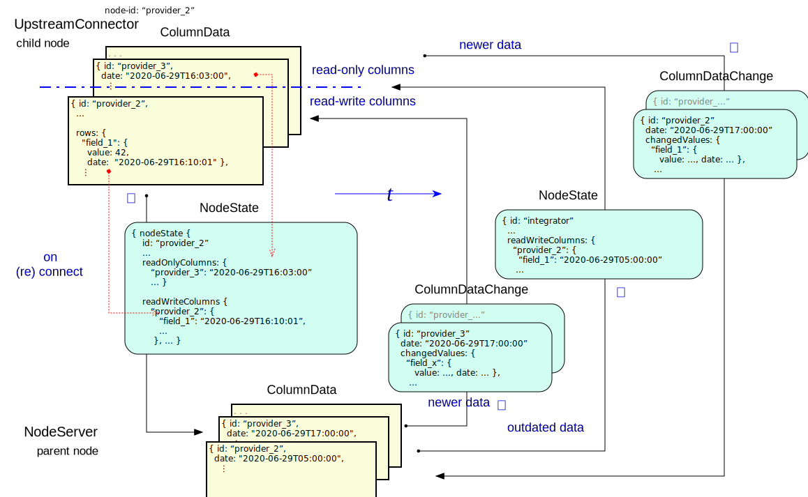

# SHARE

System for Hierarchical Ad hoc Reporting  

Peter.C.Mehlitz@nasa.gov 
NASA Ames Research Center

## Slides
@:navigationTree { entries = [ { target = "#" } ] }

## Problem
* task/incident related hierarchical reporting across heterogenous, isolated org entities (providers)
* rapid, non-disruptive rollout/tear down
* dynamic provider- and data sets
* fail-operational

  

## Key Requirements
* **non-intrusive**: no modification of provider machines/network, no end user installation
* **fail-operational**: no single point of failure causing data loss
* **self-repairing**: automatic data sync upon (re)connection

* **flexible**: provider lists and data sets can be modified at runtime without disrupting operation
* **uniform**: can be used across several hierarchy levels
* **extensible**: optional provider specific automation

## Solution
* ad hoc overlay using dedicated, pre-configured *SHARE nodes* inside provider networks

## SHARE Node
* uniform node design (same SW, different config files)
* 4 optional functions: user-server, node-server, node-client, provider-import/export
* provider-local data display and entry through user-server (browser)
* sync with upstream and downstream through node-server/node-client
* upstream/downstream/user clients: JSON over websockets (allowing non-RACE/SHARE endpoints)

  

## Conceptual Data Model and Flow
* distributed, replicated, filtered spreadsheet with typed rows (int,real,bool,string,intList,realList)
* columns owned by providers (write access)
* cells hold value and time
* owner + date resolve conflicts (CRDT)
* supports formulas (value- and time triggered)
* sync through connector upstream node

## SHARE Data Update
* configured (semi-) static structure: **ColumnList**, **RowList** 
* dynamic data: **ColumnData** (morphable key-value maps)
* change stimulus: **ColumnDataChange**, time-triggered formulas
* complete state snapshot: invariant **Node** object

## Detailed Data Model

  

## Formulas

## Data Resynchronization Protocol
* based on column ownership (provider node) and ColumnData dates
* dates transmitted with *NodeState* message (per-CD for ext. columns, per-cell for own)
* newer own data transmitted with normal *ColumnDataChange* messages
* protocol can run in cycles until fixpoint is reached, i.e. does not need to halt local op

## Detailed Data Resynchronization

  

## Web Client

## Provider Data Import / Export
* utilizing comprehensive RACE Import/Export actor infrastructure
* this is RACEs native domain (http, JMS, Kafka, sockets, ..., XML, Json, Protobuf, binary, ...)
* supports soft-realtime with > 1000 msg/sec
* configured actors that communicate via publish/subscribe channels
* imports processed as normal ColumnDataChange events
* can be gradually introduced/extended

  
## Actors
* SHARe is generic RACE application
* using actors as concurrent execution units

  

## TBD
* demo / presentation slides
* NTP implementation for clock sync
* runtime RowList/ColumnList swap
* user auth (pw change)
* more clients (Flutter)
* specs (variants, Fret?)
* global monitoring (Mesa?)