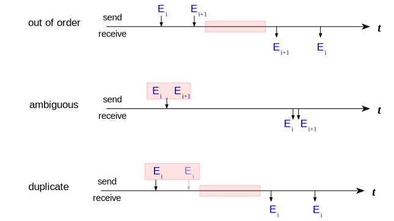
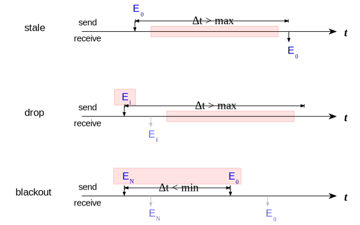

# Time Series Analysis Infrastructure
detect anomalies 

## Data Model - Track Update Channels
* (multiplexed) channels with messages that update _tracks_ (enRoute flights, ASDE-X tracks, ..)
* transformed into stream of per-track update events that have timestamps
* each stream constitutes time series over track states 

## Order- and Content Anomalies
* out-of-order: older update received later
* ambiguous: same timestamp, different data
* duplicate: same timestamp, same data

## Duration-Based Anomalies
* stale: dead on arrival
* drop: not terminated, not updated
* blackout: terminated, then updated

