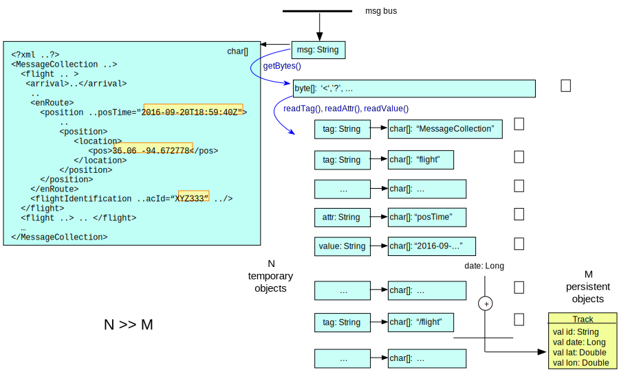
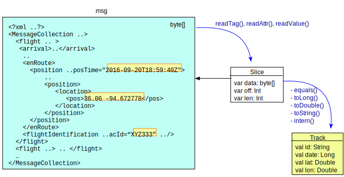
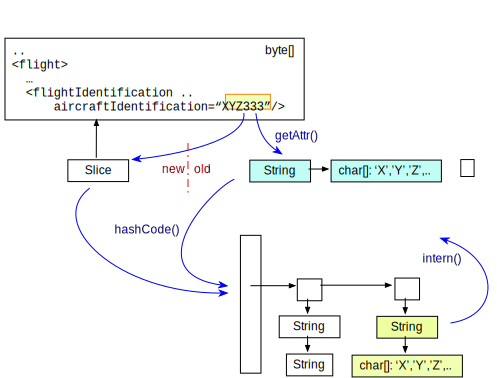
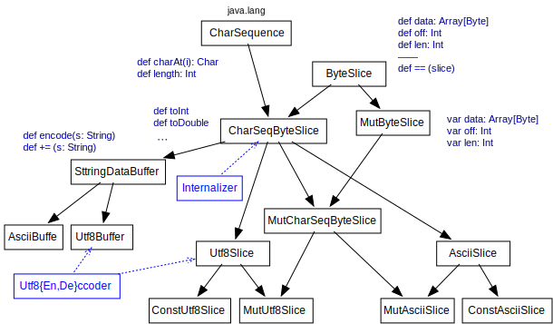
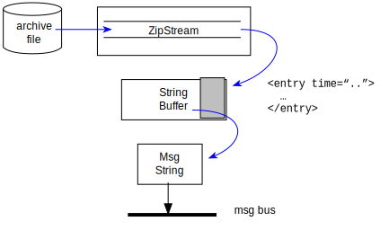
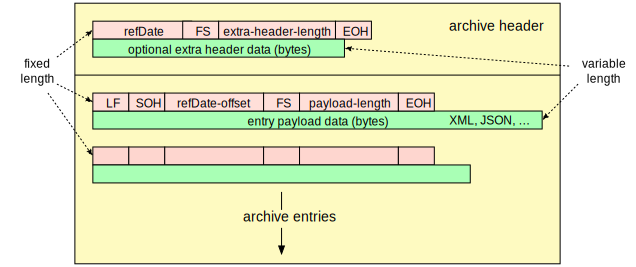
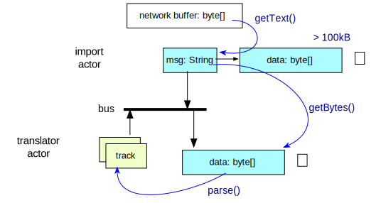
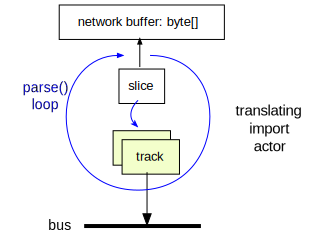
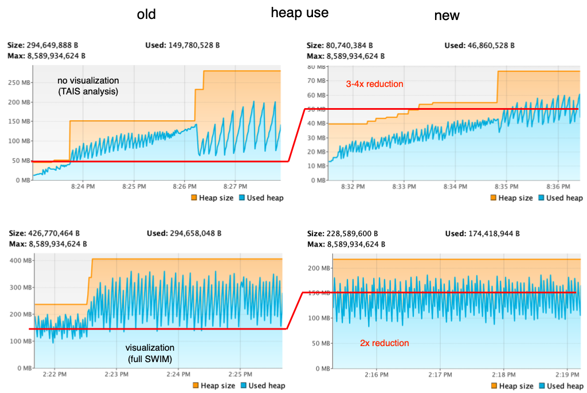

# Zero Copy Data Acquisition
avoid wasting heap on pre-requisites 

~

<a href="https://ti.arc.nasa.gov/profile/pcmehlitz/" rel="author">Peter.C.Mehlitz</a> 
SGT Inc, NASA Ames Research Center

## Slides
@:navigationTree { entries = [ { target = "#" } ] }

## Problem

* RACE used for production systems with demanding tasks (e.g. trajectory analysis)
* needs all the CPU cycles and heap memory for those tasks it can get
* task entities (track objects etc.) translated from large volume text input (JMS,sockets,http)
* Java text processing infrastructure causes huge amounts of short living objects with
  char/byte access overhead ⟹ heap pressure 

  
## Example: Extracting Track Information from SWIM

## Solution: Slices instead of Strings

* slices as modifiable string objects to process relevant UTF-8 input sequences (avoid temp. Strings)
* directly provide primitive type conversion (e.g. toDouble) and String internalizing
* compatible with java.lang.CharSequence (Regex etc.)

## Example: Internalizing Strings

* needs String in order to retrieve String

## Slice Infrastructure

## Example: Extracting Replay Messages

* requires buffer to collect payload text (boundary parsing)
* requires copying buffer into payload strings

## Solution: Tagged Archive Format

* fixed headers with payload lengths
* always know how many bytes to read from compressed stream

## Problem: Large Temporary Input Objects

* Strings only created to be handed over to translators
* translators only extract bytes (for efficient parsing), requiring
  per-byte charAt(i) iteration
* huge temporary objects (SWIM messages can be > 100kB)

## Solution: Translating Import Actors

* network buffers usually byte arrays with utf-8 text
* ⟹ buffer can be directly used to synchronously parse/translate
* pro: no temp object creation/copying
* contra: message retrieval and translation not parallel

## Optimization Results

## Pros and Cons of Specialized Input Actors

* combining (network) byte data acquisition and (sync) translation avoids creating
  large temporary input message objects ("go directly from byte buffer to TrackedObject")
* zero copy translation drastically reduces number of temporary objects
* less generic (actor complexity, no text-level tasks)
* gain if cost(temp object,message) > cost(translation)
* does not scale that well if translation is too expensive to keep up with arrival rate
