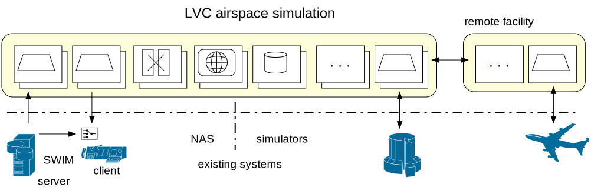
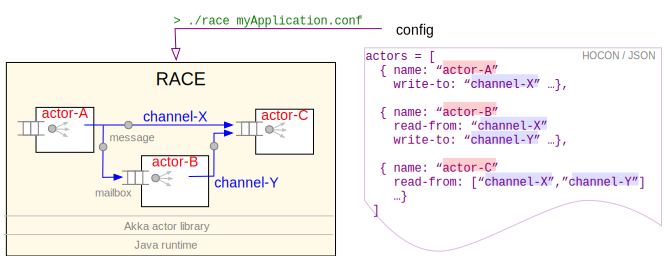
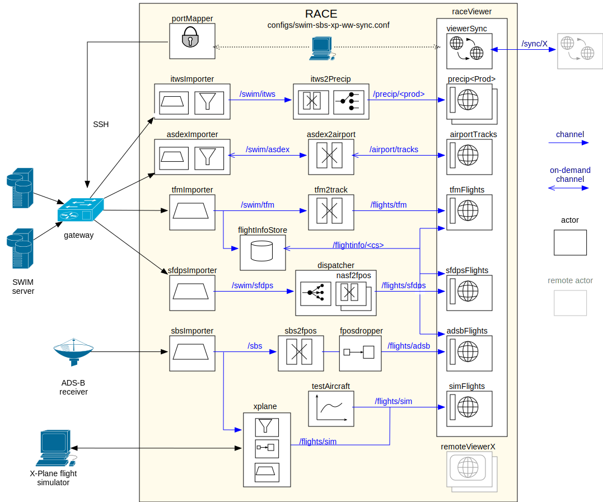
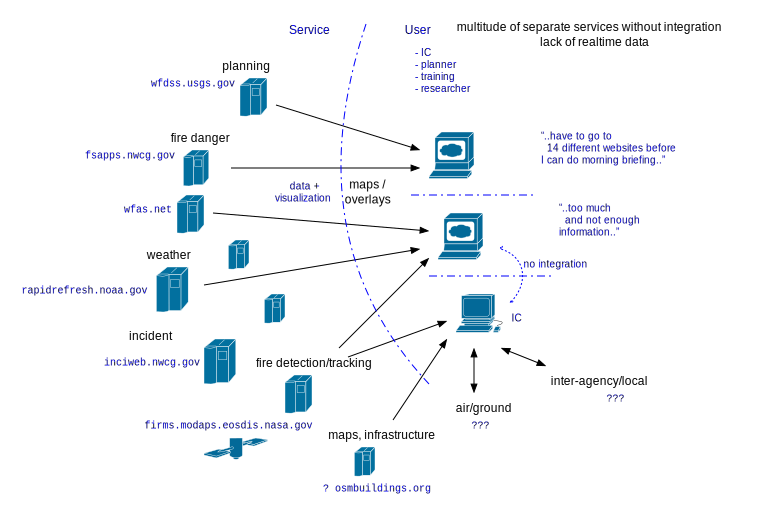
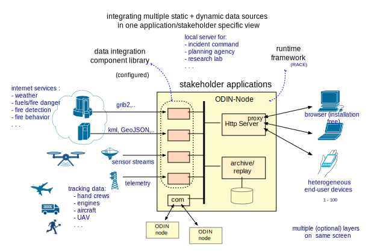
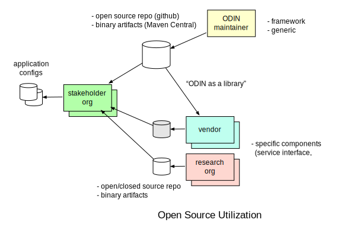
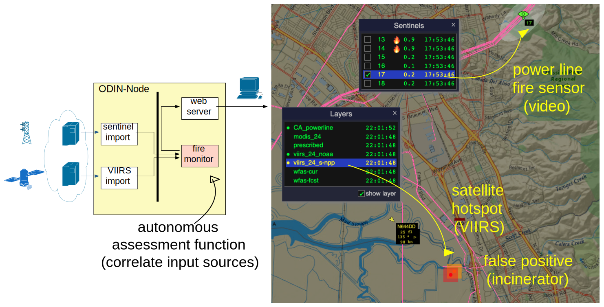
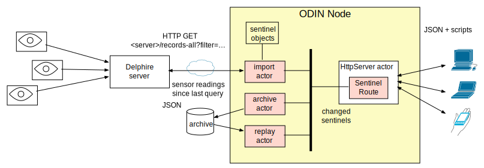
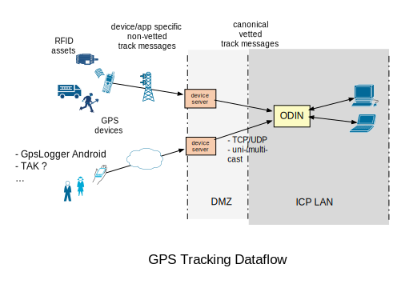

# ODIN-fire 
Open Data Integration Framework for Wildland Fire Management

website: <https://nasarace.github.io/race>  or <a href="../index.html">local</a> 
repository: <https://github.com/nasarace/race> 

Peter.C.Mehlitz@nasa.gov 
NASA Ames Research Center

<table class="keys">
<tr><td class="align-right">next slide:</td>   <td class="align-left">enter,spc,pgDown</td></tr>
<tr><td class="align-right">prev slide:</td>   <td class="align-left">sh+enter,pgUp</td></tr>
<tr><td class="align-right">goto slide:</td>   <td class="align-left">[ctrl-digit] digit</td></tr>
<tr><td class="align-right">toggle timer:</td> <td class="align-left">t</td></tr>
<tr><td class="align-right">fullscreen:</td>   <td class="align-left">f</td></tr>
</table>

## Slides
@:navigationTree { entries = [ { target = "#" } ] }

## Historical Roots of ODIN?
* started as a distributed LVC simulation framework in 2015
  

* evolved into a general framework for event driven concurrent/distributed applications:

    + can import/export from/to external systems - **connectivity**
    + can process high event rate and data volume - **scalability**
    + supports distributed and massively concurrent operation
    + has batteries included (except Java runtime, SBT build system)

## ODIN Foundation: Actor Programming Model
* well known concurrency programming model since 1973 (Hewitt et al)
* _Actors_ are objects that communicate only through async messages
  ⟹ no shared state
* objects process messages one-at-a-time ⟹ sequential code

## ODIN Implementation: Actor System
* runs on JVM, programmed in Scala using Akka actor library
* ODIN node = set of communicating actors
* ODIN messages are sent through (logical) publish/subscribe **channels**
* ODIN actors/channels are runtime configured (JSON), not hardwired

## ODIN Application Design
* uniform design - everything is an actor
* toplevel actors are deterministically created, initialized and terminated
  by _Master_ actor
* actors communicate through (configured) bus channels

## Example: Data Diversity and Volumne
* live NAS visualization plus local sensors
* imports SWIM messages (SFDPS,TFM-DATA,TAIS,ASDE-X,ITWS) and local ADS-B
* up to 1000 msg/sec, 4500 simultaneous flights
* RaceViewerActor uses embedded NASA WorldWind for geospatial display

  
  

1: ./race --vault ../conf config/air/swim-all-sbs-ww.conf

1: ./race -Darchive=../data/all-080717-1744 config/air/swim-all-sbs-replay-ww.conf

## Wildland Fire Management Application - Current
* fragmented: *"..have to hop between 14 different websites to create morning briefing.."*
* no single view across stakeholder-specific external (edge) services and own tracking / sensors

## Wildland Fire Management Application - Vision
* ODIN node = data integration hub as field deployable server
* provides task-specific view across various input sources (layers)

1: ./race --vault ../conf config/cesium/cesium-app.conf

## Why Open Source?
* *community* is larger than fire agencies (>600)
* provide common ground with low barrier of entry for stakeholders, vendors and research orgs

## Example - Multi-Sensor Data Integration 
* collaboration with Delphire to integrate their Sentinel fire sensors
* provides visual, infrared and gas sensor readings along power lines
* good to correlate with other inputs such as satellite based IR (VIIRS)

## Sentinel Sensor 
* import of Sentinel Sensor Records (JSON) from Delphire's edge server
* archive/replay with standard RACE infrastructure
* visualization through SentinelRoute (HttpServer actor)

## Tracking

